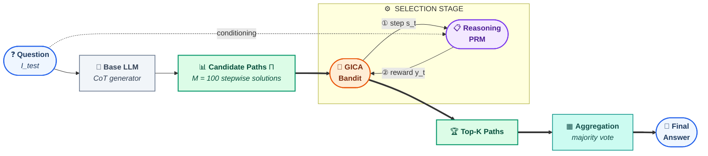
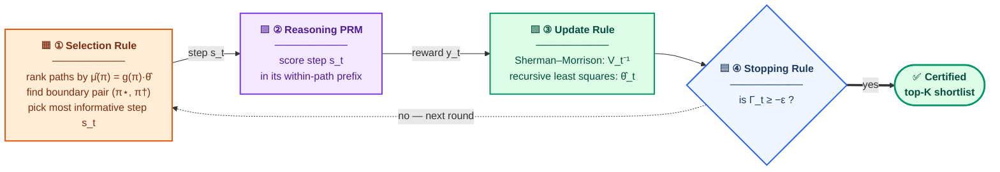

<p align="center">
  
</p>

<h1 align="center">GICA</h1>
<p align="center"><b> The Gap-Index Compositional Arm Framework for Sample-Efficient Test-Time Scaling</b></p>


> Reference implementation and reproduction package for the paper
> **“GICA: The Gap-Index Compositional Arm Framework for Sample-Efficient Test-Time Scaling.”**

---

## 1. Project Title & Abstract

**Test-time scaling (TTS)** improves the reasoning of large language models (LLMs) by sampling
many candidate chain-of-thought (CoT) solutions and using a **verifier** to select among them.
**Process reward models (PRMs)** that score *every intermediate step*, especially recent
*reasoning-based* PRMs that generate a long verification CoT before emitting a score, are the most accurate verifiers, but they are prohibitively expensive: their cost grows with both the number of candidate paths `M` and the number of steps per path.

**GICA** makes fine-grained, step-level verification practical at scale. It recasts process-level verification as a **fixed-confidence top-K identification problem over compositional arms**, i.e., each
reasoning path is a *parent arm* whose feature is the length-normalized average of its step
features under a *shared* linear utility model. Because every step query updates the shared
parameter, **one verifier call informs every path at once**. GICA adaptively queries only the most
informative steps along the most ambiguous top-vs-challenger boundary, and stops as soon as its
top-K shortlist is statistically certified.

Empirically, GICA **matches the accuracy of exhaustive Best-of-M process verification** while
reducing verifier calls by up to **4.2×** and inference runtime by up to **4.3×** relative to the
strongest bandit baseline, across three math-reasoning benchmarks (MATH-500, MathOdyssey, AIME),
two open-weight generators (DeepSeekMath-RL-7B, InternLM2-Math-Plus-7B), and two reasoning-based
verifiers (ThinkPRM-1.5B, ThinkPRM-7B).

This repository contains **two self-contained experimental tracks**:

- **Track 1 — Synthetic** (`src/gica/synthetic/`): isolates the bandit algorithm’s sample
  efficiency on compositional top-K instances with a known ground-truth parameter. CPU-only,
  deterministic, runs in seconds. 
- **Track 2 — Test-Time Scaling** (`src/gica/tts/` + `scripts/tts/`): the end-to-end TTS pipeline
  with an LLM generator (pre-computed paths), a ThinkPRM verifier, and GICA or baseline selection.
  Requires CUDA GPUs and vLLM. Reproduces **Figures 4–5** and **Tables 1 & 5**.

### A note on naming (important)

The conventions are worth knowing when cross-referencing the paper:

| In the code                       | In the paper                                 |
|-----------------------------------|----------------------------------------------|
| class `GICA`                      | **GICA** (Algorithm 1)                       |
| constructor argument `m`          | **K** — the size of the top-set to identify  |
| `total_comparisons`               | number of gap-index comparisons              |
| `best_G_history`                  | per-round hardest boundary gap-index `G_t`   |
| `min_lcb_history`                 | stopping quantity `Γ_t = min(Δ̂ − W)`        |
| `pgiha` / `PGIHA` / `p_giha`      | **GICA** — the pre-rename identifier, still used for local variables and for the `ALG_PGIHA` config dict in `benchmark.py` |

---

## 2. Repository Structure

```text
GICA/
├── README.md                         # this file
├── APPENDIX_EXPERIMENTS.md           # how the appendix figures/tables are produced
├── pyproject.toml                    # installable package definition (provides `import gica`)
├── requirements-synthetic.txt        # Track-1 dependencies (CPU: numpy/scipy/matplotlib)
├── requirements-tts.txt              # Track-2 dependencies (GPU: vLLM/transformers/…)
├── .gitignore
│
├── data/                             # datasets live here (downloaded separately — see §3.3)
│   └── README.md                     # download link + expected filenames + JSON schema
│
├── src/gica/                         # the importable Python package
│   ├── __init__.py
│   │
│   ├── synthetic/                    # ── TRACK 1: synthetic experiments (Figure 3) ──
│   │   ├── environment.py            # ReasoningEnvironment: compositional linear bandit + oracle
│   │   ├── gica.py                   # ★ class GICA — Algorithm 1 (gap-index selection + RLS update)
│   │   ├── baseline_case.py          # CASE baseline (Purohit et al., 2025)
│   │   ├── baseline_lingifa.py       # LinGIFA baseline (Réda et al., 2021)
│   │   ├── baseline_mlingape.py      # m-LinGapE baseline (Xu et al., 2018)
│   │   └── benchmark.py              # ★ multi-seed benchmark harness + figure generator
│   │
│   └── tts/                          # ── TRACK 2: test-time-scaling library ──
│       ├── verifier/
│       │   ├── __init__.py           # exposes `ThinkPRM`
│       │   ├── thinkprm.py           # ★ ThinkPRM-1.5B / 7B wrapper (reasoning-based PRM, vLLM)
│       │   └── orm.py                # outcome-level (ORM) scorers used by the two ORM baselines
│       ├── selection/
│       │   ├── gica.py               # ★ class GICA for TTS (adds the dynamic boundary feature)
│       │   ├── baseline_case.py      # CASE   (TTS adaptation, no compositional feature)
│       │   ├── baseline_lingifa.py   # LinGIFA(TTS adaptation, no compositional feature)
│       │   └── baseline_mlingape.py  # m-LinGapE (TTS adaptation, no compositional feature)
│       ├── utils/
│       │   ├── prompt_template.py    # ThinkPRM verification prompt template
│       │   └── answer_parsing.py     # step-label parsing from the verifier output
│       └── answer_extraction.py      # final-answer extraction + normalization for Exact-Match
│
└── scripts/                          # runnable experiment drivers (entry points)
    └── tts/
        ├── run_gica.py               # ★ GICA TTS driver (ThinkPRM-1.5B; main results)
        ├── run_gica_topm_thinkprm7b.py   # GICA driver, ThinkPRM-7B (CLI args; Table 5 / Fig 5)
        ├── run_gica_topm_steplabels.py   # GICA driver, alternative final-pick by prefix score
        ├── run_baselines.py          # CASE / LinGIFA / m-LinGapE TTS driver (CLI args)
        ├── run_best_of_m.py          # ★ exhaustive Best-of-M upper bound (ThinkPRM-1.5B, batched)
        ├── run_top1.py               # Top-1 decoding reference (no verification)
        ├── run_majority_vote.py      # majority-vote / self-consistency reference
        ├── run_orm_rerank_v2.py      # ORM reranking baseline (Table 1, "ORM" row)
        ├── run_orm_prm_cascade.py    # ORM→PRM cascade baseline (Table 1, "ORM-PRM cascade" row)
        ├── baseline_common.py        # shared loading / grading / output helpers for the two ORM drivers
        └── orm.py                    # stand-alone copy of the ORM scorers (unused: the drivers
                                      #   import the packaged `gica.tts.verifier.orm` instead)
```

`★` marks the files most central to the paper.

---

## 3. Prerequisites & Installation

The two tracks have **disjoint** dependency sets. Track 1 is CPU-only and tiny, while Track 2 needs GPUs and a heavyweight LLM-serving stack. Install whichever you need (or both).

### 3.0 Common: clone and create the package environment

Every track shares one importable package, `gica`, so start by cloning the
repository and setting up a Python environment. The project was developed and
tested with **Python 3.11.5**, any
Python ≥ 3.9 should work (the floor declared in `pyproject.toml`).

First, clone the repository and enter it:

```bash
git clone https://github.com/mohsen1amiri/GICA.git
cd GICA
```

Next, create and activate an isolated environment using **either** conda **or**
Python's built-in `venv`. You only need one.

**Option A — conda**

```bash
conda create -n gica python=3.11 -y
conda activate gica
```

**Option B — venv** (use this on an HPC cluster where Python comes from
environment modules)

```bash
# On an HPC cluster, first load the Python module:
module load Python/3.11.5-GCCcore-13.2.0 IPython/8.17.2-GCCcore-13.2.0

# Create the virtual environment (a local `.venv/` folder)
python -m venv .venv

# Activate it
source .venv/bin/activate           # Linux/macOS (bash/zsh)
# .venv\Scripts\activate            # Windows (PowerShell/cmd)

# Make sure pip/setuptools are current
python -m pip install --upgrade pip setuptools wheel
```

Finally — with the environment active, whichever you chose — install the `gica`
package itself in editable mode so that `import gica` works from anywhere:

```bash
pip install -e .
```

Keep this environment active for the track-specific dependency installs in §3.1
(synthetic) and §3.2 (test-time scaling) below. To leave the environment later,
run `conda deactivate` (conda) or `deactivate` (venv).

### 3.1 Track 1 — Synthetic (CPU)

```bash
pip install -r requirements-synthetic.txt
```

That is all you need for the synthetic track. No GPU, no datasets, no model downloads.


### 3.2 Track 2 — Test-Time Scaling (GPU)

```bash
pip install -r requirements-tts.txt
```

This installs **vLLM 0.7.1**, **transformers 4.48.2**, **sentence-transformers**, etc. (pinned to
the versions used in the paper). You will additionally need access to the following models (they
download automatically on first use via Hugging Face):

- **Verifiers:** `launch/ThinkPRM-1.5B` (main results) and `launch/ThinkPRM-7B` (ablation).
- **Sentence encoder:** `all-MiniLM-L6-v2` (used to embed reasoning steps).

> **Hardware.** Track 2 runs ThinkPRM under vLLM on the GPU. ThinkPRM-1.5B fits on a single
> modern GPU; ThinkPRM-7B benefits from more memory. The drivers set
> `gpu_memory_utilization=0.98` and `tensor_parallel_size=1` by default — adjust inside
> `src/gica/tts/verifier/thinkprm.py` (or the driver call site) for your hardware.

### 3.3 Download the datasets (Track 2 only)

The TTS experiments consume **pre-generated candidate reasoning paths** (not raw benchmarks).

> **Please download the JSON data from** **https://osf.io/v7muk/**
> **and unzip `data.zip` at the repository root so its contents land in `data/`.**

See [`data/README.md`](data/README.md) for the expected filenames and the JSON schema. In short,
each file provides, per question, the `prompt`, a list of `M = 100` candidate `completion` paths,
and the ground-truth `answer`.

---

## 4. Code Architecture & Contents

### 4.1 The big idea (how the data flows)

Both tracks implement the same fixed-confidence selection loop and differ only in
**where the verifier signal comes from**. The end-to-end TTS workflow (Figure 1 of
the paper) has two stages: a **Selection Stage**, where the GICA bandit evaluates the
`M` candidate paths via a step-level reasoning-based PRM queries to certify a top-`K` shortlist
*without* full path evaluations, and an **Aggregation Stage**, which collapses that
shortlist into a final answer by majority vote.



> **Inside the Selection Stage**, GICA never scores whole paths. Each round, it queries
> a *single* step, gets one reward, and updates a shared model — so a verifier call that
> looks at one step sharpens the estimate of **every** path at once.

The selection loop is where the sample efficiency comes from. Figure 2 of the paper
zooms into **one round** of Algorithm 1. Under the shared estimate `θ̂_t`, the
**Selection Rule** ranks the paths and locks onto the single hardest decision — the
**boundary pair** `(π⋆, π†)` that separates the current top-`K` shortlist from its
toughest challenger. It then queries the one step `s_t` that most reduces uncertainty
on that boundary. The reasoning-based **PRM** returns reward `y_t`, the **Update Rule** refreshes
`(V_t, θ̂_t)`, and the **Stopping Rule** loops until the shortlist is certified
(`Γ_t ≥ −ε`).




The two tracks differ only in the PRM box, i.e., **Track 1 (synthetic)** replaces it with an
oracle returning `x_s·θ⋆ + noise`, and **Track 2 (TTS)** uses **ThinkPRM**, which reads the
question plus the step's within-path prefix and returns a correctness score in `[0, 1]`.
Because the linear parameter `θ` is **shared across all paths**, a single step
observation tightens the utility estimate of *every* path — the compositional
information sharing that gives GICA its `O(1)`-per-round query cost (versus `O(T_p·M)`
for path-arm baselines) and a sample-complexity bound with **no dependence on `M`**
(Theorem 3.8).


### 4.2 Track 1, Synthetic (`src/gica/synthetic/`)

**`environment.py`** builds a compositional linear bandit instance via `ReasoningEnvironment`, following a *"random instance, control the boundary gap, measure ρ"* design.

It creates a unit parameter `true_theta` ( θ⋆ ), Gaussian step features, and a full coverage partition of steps into variable length paths. Each path's steps are calibrated by a constant offset along θ⋆ so that the path utility hits a target value. This utility calibration is the only structural intervention.

The rank K versus rank (K + 1) **boundary gap** Δ_C is *controlled*. It is set to

    Δ_C = theta_norm · grid_gap

through a rigid top K shift, while everything off the θ⋆ axis stays random.

The environment exposes the following accessors.

- `get_ground_truth()` returns each path utility μ(π), the length normalized average of its step utilities.
- `oracle_callback(step)` returns the step level verifier signal

      r_s = x_s · θ⋆ + ε,    ε ∼ Gaussian noise

- `oracle_callback_path(path)` returns the corresponding path level signal.

The geometry constant ρ† (Assumption 3.2) is **not** controlled, since it is an emergent property of the random geometry. The environment therefore *measures* it in two ways.

- Statically over the boundary set C⋆_K, via `estimate_rho_dagger` and `measure_assumption_3_2`.
- Along the algorithm realized trajectory, via `reset_realized_rho()`, `update_realized_rho(V⁻¹)`, and `get_realized_rho()`.

Pass `top_k` to set the binding rank, using the same K or m the algorithms identify. Run the file directly for a one shot structure and ρ report.

**`gica.py`** implements `class GICA`, the full Algorithm 1. Each round it performs the following steps.

1. Compute the exact determinant based confidence radius β_t(δ) in log space for stability.
2. Form the empirical top K shortlist and evaluate the stopping rule

       Γ_t ≥ −ε

3. Select the most ambiguous boundary pair by the gap index

       G_t = Δ̂² / σ²

4. Query the step that maximizes the exact one step variance contraction

       C_t(s) = ⟨ g(π⋆, π†), x_s ⟩²_{V⁻¹} / ( 1 + ‖x_s‖²_{V⁻¹} )

5. Apply the Sherman Morrison and recursive least squares update.

Setting `step_pool_mode="paths"` restricts candidate steps to the boundary pair, which is the paper setting.

**`baseline_case.py`, `baseline_lingifa.py`, `baseline_mlingape.py`** are faithful path arm reimplementations of CASE, LinGIFA, and m-LinGapE. All expose the same `select_and_update(oracle) → (done, top_ids)` interface and the same logging fields as GICA.

**`benchmark.py`** is the experiment harness that produces Figure 3, comparing GICA against CASE, LinGIFA, and m-LinGapE. It provides the following features.

- A `FairOracle` that gives each step and path its own deterministic, order independent noise stream, so every algorithm sees identical feedback.
- A `step_surrogate` mode that runs the baselines on step arms and ranks real paths via the learned θ̂, which is how the paper adapts them to the compositional setting.
- A `PATH_PULL_MODEL` switch with two settings, `single` and `avg_steps`. The `avg_steps` setting physically queries every step, so runtime and the 1 / √T noise reduction stay exact.
- Optional per trajectory ρ† measurement whose timing is excluded from the reported runtime.
- A `run_trials` routine that records verifier calls, runtime, gap index comparisons, accuracy, and ρ† across seeds.

### 4.3 Track 2, Test Time Scaling (`src/gica/tts/` + `scripts/tts/`)

Track 2 is the end-to-end TTS pipeline behind Sections 4.3 and 4.4 of the paper (Figures 4 and 5, Tables 1 and 5). A generator LLM produces M candidate reasoning paths per question, a reasoning-based PRM scores individual steps, a bandit selection rule decides which steps to query, and the surviving top-K paths are collapsed into one answer that is graded by Exact Match. The library code lives under `src/gica/tts/` and the runnable experiments under `scripts/tts/`.

The library splits into four parts, a verifier, selection algorithms, verifier-side utilities, and an answer-extraction module.

#### `src/gica/tts/` (library)

**`verifier/thinkprm.py`** wraps the ThinkPRM reasoning-based PRM (Khalifa et al., 2026) under vLLM and is the component that actually performs verification. Given the question together with a within-path step prefix, the model first generates a verification chain of thought and then emits a decision. The class converts the decision into a scalar reward in two ways.

- A prefix confidence. It reads the log probabilities of the " Yes" and " No" decision tokens and turns them into a number in

      [ 0, 1 ]

  via a temperature-scaled softmax,

      confidence = exp(pos / T) / ( exp(pos / T) + exp(neg / T) )

  The last step's confidence becomes the `prefix_score`, which is the reward y_t consumed by the bandits.
- Per-step binary labels. It parses the boxed correct or incorrect tokens emitted in the verification trace into a list of `step_labels`, one label per step.

It also supports batched scoring (`predict_correctness_batch`) and an optional multi-round, sequential-scaling variant. Each verifier call corresponds to one full PRM forward pass conditioned on the prefix, which is the verifier call cost the paper reports.

**`verifier/__init__.py`** exposes `ThinkPRM` at the package level. The commented entries for discriminative and other PRM types mark variants that are not used in the paper.

**`selection/gica.py`** implements the TTS version of `class GICA`, the realization of Algorithm 1 on real reasoning paths. Per round it forms the plug-in path estimates

      mu_hat(p) = g(p) . theta_hat

  ranks them into a top-K shortlist, and checks the worst-case lower-confidence-bound stopping quantity against the threshold

      Gamma_t  >=  -epsilon

  It locates the hardest boundary pair by the smallest gap index

      G_t = gap^2 / sigma^2

  and, crucially, it is the only selection rule with the *dynamic boundary feature*. Each round it overwrites the reserved last feature slot of every step with the projection of that step's embedding onto the current boundary direction

      centroid(top path)  -  centroid(challenger path)

  It then queries the step that maximizes the exact one-step variance contraction

      C_t(s) = ( g(p, p') . V_inv . x_s )^2 / ( 1 + x_s . V_inv . x_s )

  observes the PRM reward, and applies the Sherman Morrison plus recursive-least-squares update to (V_inv, theta_hat). Setting `step_pool_mode="paths"` confines candidate steps to the boundary pair, which is the paper setting.

**`selection/baseline_case.py`, `selection/baseline_lingifa.py`, `selection/baseline_mlingape.py`** are the TTS adaptations of CASE (Purohit et al., 2025), LinGIFA (Réda et al., 2021), and m-LinGapE (Xu et al., 2018). They treat each path feature g(p) as a virtual arm but still query at the step level, matching the compositional adaptation described in Section 4.1. They share GICA's

      select_and_update(oracle) -> (done, top_ids)

  interface and logging fields, but none of them touches the reserved boundary slot, so none exploits compositional step structure.

**`selection/__init__.py`** documents the package as the bandit selection algorithms adapted to the TTS pipeline.

**`utils/prompt_template.py`** builds the exact instruction the verifier sees. `format_verification_cot_for_thinkprm` is the main inference template used in the paper. It places the math problem and the proposed step-by-step solution into the ThinkPRM chat format and asks the model to review and critique each step. The file also keeps a training-time template and a non-thinking template that the paper does not use.

**`utils/answer_parsing.py`** holds the verifier-side parsing helpers. `extract_step_labels` recovers the boxed correct or incorrect decisions from a verification trace into binary labels, and the remaining helpers (`retrieve_answer`, `judge_answer`, `get_majoirty_answer`) support answer retrieval and majority voting.

**`utils/__init__.py`** documents the package as the verifier-side utilities for the prompt template and step-label parsing.

**`answer_extraction.py`** normalizes free-form model output into a canonical answer string for grading. `extract_answer` pulls the final answer from boxed expressions, "the answer is" phrasings, or a trailing number, and `strip_string` together with its LaTeX-cleanup helpers (fixing fractions, square roots, and similar) canonicalizes both the prediction and the ground truth so that Exact Match is robust.

#### `scripts/tts/` (drivers)

Every bandit driver embeds a small `PRMEnvironment` class that turns one question and its M candidate paths into a bandit instance. It splits each path into steps on the delimiter `".\n"`, embeds the steps with `all-MiniLM-L6-v2`, and builds the compact 6-dimensional step feature

      [ cos(step, question),
        cos(step, path centroid),
        cos(step, global centroid),
        position fraction,
        bias = 1,
        boundary placeholder = 0 ]

In the GICA drivers the environment's `oracle_callback(step)` reconstructs the within-path prefix and calls the verifier, and this call is what counts as a **verifier call**. `run_baselines.py` is the path-arm adaptation, so its `oracle_callback(path)` instead scores a whole path and returns the mean of its step labels. Each driver also defines `compute_em_from_top_m`, which picks a winning path from the returned top-K, extracts and normalizes its answer, and computes Exact Match.

**`run_gica.py`** is the main GICA driver. It instantiates `selection.gica.GICA` with ThinkPRM-1.5B as the verifier, loops over a benchmark file, runs the selection rule per question, and grades the output. Its winner rule takes the first path in the GICA shortlist directly. Like the CLI drivers it writes a per-question `qid, iter, time, EM` CSV, so Figure 4 is assembled exactly like Figure 5.

**`run_baselines.py`** runs the three bandit baselines through a shared harness. A `--baseline_name` argument selects CASE, GIFA (LinGIFA), or m-LinGapE, and a `--file_path` argument selects the dataset. Its winner rule re-scores each shortlisted path with the verifier and keeps the highest-scoring one. This driver is configured with ThinkPRM-7B in the repository.

**`run_best_of_m.py`** is the exhaustive upper-bound reference. It scores *every* step of *every* candidate path with the PRM (here ThinkPRM-1.5B), streaming the paths through the verifier in batches of `BATCH_SIZE`, and once a question is fully scored it takes the path with the highest mean step-label as the winner. It issues the maximum possible number of verifier calls and defines the accuracy ceiling against which GICA's savings are reported. Per-question path scores are written to a JSON file.

**`run_top1.py`** is the floor reference. It takes the first sampled path per question with no verification at all and reads the answer directly, isolating the contribution of the generator alone.

**`run_majority_vote.py`** is the self-consistency reference. Its `self_con` routine extracts the final answer from every candidate path and returns the most frequent one, with no PRM involvement.

**`run_gica_topm_steplabels.py`** is a GICA variant whose final-winner rule re-ranks the shortlist by the verifier `prefix_score` rather than taking the first path, isolating the effect of the winner-selection rule from the selection mechanism itself.

**`run_gica_topm_thinkprm7b.py`** repeats the GICA pipeline with the larger ThinkPRM-7B verifier and exposes `--file_path` and `--dataset_name` arguments. It produces the verifier-scale ablation reported in Appendix C.1 (Table 5 and Figure 5).

The last two drivers are the outcome-level comparisons of Table 1. Neither is a bandit, so neither builds a `PRMEnvironment`, and both grade with the helpers in `baseline_common.py` so their Exact Match is computed by exactly the rules the other drivers use.

**`run_orm_rerank_v2.py`** is the **ORM** row. It scores every complete candidate path once with an outcome-level verifier, with no step-level verification at all, and reports two winner rules, i.e., the argmax of the ORM score and an ORM-score-weighted vote over the normalized answers. `--orm_backend` picks the scorer: `thinkprm` reuses `--prm_model` in outcome mode (the whole path is passed as a single step, so no extra weights are loaded), while `seqcls` and `rlhflow` load a separate Hugging Face reward model named by `--orm_model`. Its cost is M outcome-level calls per question against M step-level calls for Best-of-M. It writes `orm_rerank_<backend>_<dataset>.csv` and caches its scores to `orm_scores_<dataset>.json`. By default it runs every question in `--file_path`; `--index_file` restricts the run to a saved list of question indices.

**`run_orm_prm_cascade.py`** is the **ORM-PRM cascade** row. Phase 1 scores all M paths with the cheap ORM, phase 2 sends only the top-`--cascade_top_c` shortlist to step-level ThinkPRM verification, and the winner is chosen exactly as in `run_best_of_m.py` (argmax of mean step labels, with a PRM-weighted vote also reported). Passing `--orm_scores orm_scores_<dataset>.json` from the rerank driver skips phase 1 entirely. Cost is M ORM calls plus `--cascade_top_c` step-level PRM calls; the paper's Table 1 cascade re-ranks the top **20**, while the flag defaults to 5. It writes `cascade_<backend>_top<C>_<dataset>.csv`.

**`baseline_common.py`** holds the loading, grading, and output helpers shared by the two ORM drivers. `load_dataset` reads the `data/` JSON schema and applies `--data_limit`; `grade_path_best_of_m` is the winning-path Exact-Match rule of `run_best_of_m.py`; `self_con` and `self_con_answer` are the normalization and tally of `run_majority_vote.py`, kept verbatim so the numbers stay comparable, and `weighted_self_con` is their score-weighted variant. It is imported by path rather than through the `gica` package.

**`orm.py`** is a stand-alone copy of the outcome-level scorers (`ThinkPRMOutcomeORM`, `SeqClsORM`, `RLHFlowORM`, and the `build_orm` factory). The drivers import the packaged `gica.tts.verifier.orm` instead, so this copy is not used at runtime.

---

## 5. Quick Start and Tutorial

The fastest way to confirm everything is wired correctly is the **synthetic track**, which needs no GPU, no downloaded data, and finishes in seconds. The test-time-scaling track is covered afterwards and does require CUDA GPUs.

GICA targets Python 3.9 or newer. The instructions below give two equivalent ways to create an isolated environment, the standard-library `venv` and `conda`. Pick whichever you prefer. The remaining steps are identical in both cases.

### 5.1 Create an environment and install

#### Option A, venv (standard library, no extra tooling)

```bash
# from the repository root
python -m venv .venv

# activate it
source .venv/bin/activate          # Linux or macOS
# .venv\Scripts\activate           # Windows PowerShell

python -m pip install --upgrade pip
```

#### Option B, conda

```bash
conda create -n gica python=3.10 -y
conda activate gica
```

#### Install the package (both options)

The project is installable in editable mode, so source edits take effect without reinstalling. Install GICA itself, then the lightweight synthetic-track dependencies.

```bash
pip install -e .                          # installs the gica package
pip install -r requirements-synthetic.txt # numpy, scipy, matplotlib (CPU only)
```

The synthetic track is intentionally minimal. It depends only on NumPy, SciPy (used by one m-LinGapE selection rule), and Matplotlib (used for figure generation). The heavier test-time-scaling dependencies are installed separately in Section 5.4.

### 5.2 One-line sanity check

This snippet builds a small compositional instance, runs GICA to certify an epsilon-optimal top-5 shortlist, and reports how many verifier calls it needed and how many of the true top-5 paths it recovered. The run is fully deterministic given the seed.

Note that `top_k` is passed so that the environment's controlled rank-K boundary matches the shortlist size the algorithm certifies. Setting `top_k = m` is what makes the run terminate quickly and is the intended usage of the updated environment.

```bash
python - <<'PY'
from gica.synthetic.environment import ReasoningEnvironment
from gica.synthetic.gica import GICA

# Build a compositional instance with a controlled rank-5 boundary gap.
env = ReasoningEnvironment(num_paths=40, dim=8, noise_std=0.1, top_k=5, seed=0)

truth = sorted(env.get_ground_truth().items(), key=lambda x: x[1], reverse=True)
true_top5 = {pid for pid, _ in truth[:5]}

g = GICA(env.paths, env.feature_matrix, m=5, d=8,
         lambda_reg=1.0, epsilon=0.1, delta=0.05, R=0.1, S_0=2.0,
         step_pool_mode="paths")

done = False
while not done and g.t < 5000:
    done, est = g.select_and_update(env.oracle_callback)

print(f"GICA converged in {g.t} verifier calls, "
      f"recovered {len(set(est) & true_top5)}/5 of the true top-5.")
PY
```

Expected output, deterministic given the seed.

```text
GICA converged in 33 verifier calls, recovered 5/5 of the true top-5.
```

If you see 5/5 recovered and a convergence count in the low tens, the installation is correct. The exact count depends on the seed, the instance size, and the tolerance epsilon.

### 5.3 Run the full synthetic benchmark 

```bash
python -m gica.synthetic.benchmark
```

This runs GICA and the bandit baselines (CASE, LinGIFA, m-LinGapE) over multiple seeds and writes the pairwise and all-algorithm comparison figures to a `plots/` directory, which is created automatically in the current working directory. The figures cover gap-index comparisons, verifier calls, runtime, accuracy, and the measured pair-step correlation rho.

On a cluster, wrap the same command in a batch job; the benchmark needs no scheduler-specific setup of its own.

### 5.4 A minimal test-time-scaling run

The test-time-scaling track runs the full pipeline with a real generator and a reasoning-based PRM, so it requires CUDA GPUs and the heavier pinned dependencies. Install those first.

```bash
pip install -r requirements-tts.txt
```

This pulls in vLLM, Transformers, sentence-transformers, and the other libraries pinned to the versions used in the paper. The first run also downloads the ThinkPRM verifier weights, so expect a one-time setup cost.

With a benchmark file present under `data/` (for example `data/Deepseek-MathOdyssey-RL-7B.json`), run GICA from the repository root.

```bash
python scripts/tts/run_gica.py
```

This loads ThinkPRM-1.5B, runs GICA over the MathOdyssey paths, and prints running Exact-Match accuracy together with per-query verifier-call and timing statistics. The baseline and reference drivers described in Section 4.3 are launched the same way, for example.

```bash
# a bandit baseline (CASE, GIFA, or m-LinGapE) on a chosen dataset.
# --data_limit and --dataset_name are both required: the first bounds the run,
# the second names the per-question CSV this driver writes.
python scripts/tts/run_baselines.py --baseline_name CASE \
    --file_path data/Deepseek-MathOdyssey-RL-7B.json \
    --dataset_name MathOdyssey --data_limit 400

# the exhaustive upper bound and the two cheap references
python scripts/tts/run_best_of_m.py
python scripts/tts/run_top1.py
python scripts/tts/run_majority_vote.py
```

When you are finished, leave the environment with `deactivate` (venv) or `conda deactivate` (conda).

---

## 6. Reproducing the Main Results

All commands run from the repository root with the `gica` environment active and, for the
test-time-scaling experiments, the datasets present in `data/`.

This section covers the paper's **main results**: Figure 3 (synthetic sample efficiency, RQ1),
Table 1 with Figure 4 (the TTS pipeline, RQ2/RQ3), and the ρ† sensitivity study of Section 4.5.
The appendix figures and tables — the full Appendix B.1 parameter list, Table 5 and Figure 5,
Figures 6–8 and Table 6 — are covered in
[`APPENDIX_EXPERIMENTS.md`](APPENDIX_EXPERIMENTS.md).

### 6.1 Figure 3 — synthetic sample efficiency (RQ1)

The committed defaults in the `__main__` block of `src/gica/synthetic/benchmark.py` are the
paper's Appendix B.1 configuration, so the benchmark reproduces the synthetic protocol as
shipped. Run once per problem scale, editing only `ENV_CFG["num_paths"]` between runs:

```bash
python -m gica.synthetic.benchmark      # repeat with num_paths = 200, 500, 1000
```

Each run writes `plots/compare_*` figures. The three panels of Figure 3 are **(a)** gap-index
comparisons, **(b)** verifier calls and **(c)** runtime, read as a function of `M`.

### 6.2 Table 1 and Figure 4 — TTS pipeline (RQ2/RQ3)

Common settings (Appendix B.2): shortlist size `K = 5`, `δ = 0.05`, `λ = 1.0`, generators
`DeepSeekMath-RL-7B` and `InternLM2-Math-Plus-7B`, `M = 100` paths per question, with
ThinkPRM-1.5B as the verifier.

| Paper artifact | Command |
|---|---|
| **Top-1 decoding** (floor) | `python scripts/tts/run_top1.py` |
| **Best-of-M** (exhaustive upper bound) | `python scripts/tts/run_best_of_m.py` |
| **GICA** | `python scripts/tts/run_gica.py` |
| **Bandit baselines** | `python scripts/tts/run_baselines.py --baseline_name CASE --file_path data/Deepseek-MathOdyssey-RL-7B.json --dataset_name MathOdyssey --data_limit 400` |
| **ORM** | `python scripts/tts/run_orm_rerank_v2.py --file_path data/Deepseek-MathOdyssey-RL-7B.json --dataset_name MathOdyssey` |
| **ORM-PRM cascade** | `python scripts/tts/run_orm_prm_cascade.py --file_path data/Deepseek-MathOdyssey-RL-7B.json --dataset_name MathOdyssey --cascade_top_c 20` |

For the baseline driver, `--baseline_name ∈ {CASE, GIFA, lingape}`. Note that
`run_baselines.py` loads `launch/ThinkPRM-7B`; for the ThinkPRM-1.5B numbers of Table 1,
change the `model_name_or_path` in its `ThinkPRM(...)` constructor.

**Steps to reproduce a full table row (example: MathOdyssey, DeepSeekMath-RL-7B, ThinkPRM-1.5B):**

```bash
# 1) upper bound and floor
python scripts/tts/run_best_of_m.py        # set the data path to Deepseek-MathOdyssey-RL-7B.json
python scripts/tts/run_top1.py             # set the data path to Deepseek-MathOdyssey-RL-7B.json

# 2) ORM, then the ORM-PRM cascade reusing the cached ORM scores
python scripts/tts/run_orm_rerank_v2.py \
    --file_path data/Deepseek-MathOdyssey-RL-7B.json --dataset_name MathOdyssey \
    --orm_backend seqcls --orm_model RLHFlow/Llama3.1-8B-ORM-Deepseek-Data

python scripts/tts/run_orm_prm_cascade.py \
    --file_path data/Deepseek-MathOdyssey-RL-7B.json \
    --dataset_name MathOdyssey --orm_scores orm_scores_MathOdyssey.json --cascade_top_c 20

# 3) GICA
python scripts/tts/run_gica.py             # already points at Deepseek-MathOdyssey-RL-7B.json

# 4) bandit baselines (one run each: CASE, GIFA, lingape)
python scripts/tts/run_baselines.py --baseline_name CASE \
    --file_path data/Deepseek-MathOdyssey-RL-7B.json \
    --dataset_name MathOdyssey --data_limit 400
```

Each driver prints the running and final **Exact-Match** (Table 1) and the mean/standard
deviation of per-query time. `run_gica.py`, `run_baselines.py` and
`run_gica_topm_thinkprm7b.py` additionally write a per-question CSV with columns
`qid, iter, time, EM`, where **`iter`** is the verifier-call count and **`time`** the
per-query inference runtime — the two quantities plotted in **Figure 4**. Collect them from
the GICA and baseline runs across MATH-500 / MathOdyssey / AIME and both generators.

To switch the **benchmark** for the hardcoded-path drivers, edit the single dataset line near
the top of the file: `DATA_PATH = "data/…json"` in `run_gica.py` (which also names its CSV), or
the `open("data/…json")` call in `run_best_of_m.py`, `run_top1.py` and `run_majority_vote.py`.
To switch the **verifier**, edit the `model_name_or_path="launch/ThinkPRM-…"` argument in the
driver’s `ThinkPRM(...)` constructor.

### 6.3 Table 2 — sensitivity to the pair–step correlation ρ† (Section 4.5)

A synthetic study. ρ† is an emergent property of the random geometry, so it is **measured**
rather than set: reseed the geometry in `src/gica/synthetic/environment.py` / `benchmark.py`,
let the benchmark measure the realized ρ† over the boundary set (`MEASURE_RHO = True`,
`RHO_PAIRS`, `RHO_EVERY` at the top of `benchmark.py`), and record GICA's verifier calls and
runtime for each seeding.

The expected trend is a cost scaling of `O(1/ρ†)`, though the empirical effect is far milder
than the worst case, since ρ† is a uniform infimum set by a few adversarial configurations
while the boundary pairs that actually bottleneck termination are aligned far more favourably.

---

## 7. Citation

If you use this code, please cite the paper:

```bibtex
@article{amiri2026gica,
  title   = {{GICA}: The Gap-Index Compositional Arm Framework for Sample-Efficient Test-Time Scaling},
  author  = {Amiri, Mohsen and V, Venktesh and Beikmohammadi, Ali and Magn{\'u}sson, Sindri},
  journal = {Transactions on Machine Learning Research},
  issn    = {2835-8856},
  year    = {2026},
  url     = {https://openreview.net/forum?id=zlyn0moogg}
}
```

## 8. References

The following works are referenced throughout this README and implemented or
built upon in this repository.

**Reasoning-based verifier (PRM)**

- M. Khalifa, R. Agarwal, L. Logeswaran, J. Kim, H. Peng, M. Lee, H. Lee, and
  L. Wang. *Process Reward Models That Think.* Transactions on Machine Learning
  Research (TMLR), 2026. arXiv:2504.16828, 2025.
  https://arxiv.org/abs/2504.16828

**Bandit baselines**

- K. Purohit, V. Venktesh, S. Bhattacharya, and A. Anand. *Sample Efficient
  Demonstration Selection for In-Context Learning (CASE).* Proceedings of the
  42nd International Conference on Machine Learning (ICML), PMLR 267, 2025.
  arXiv:2506.08607. https://arxiv.org/abs/2506.08607

- C. Réda, E. Kaufmann, and A. Delahaye-Duriez. *Top-m Identification for Linear
  Bandits (LinGIFA / GIFA family).* Proceedings of the 24th International
  Conference on Artificial Intelligence and Statistics (AISTATS), PMLR
  130:1108–1116, 2021. arXiv:2103.10070.
  https://proceedings.mlr.press/v130/reda21a.html

- L. Xu, J. Honda, and M. Sugiyama. *A Fully Adaptive Algorithm for Pure
  Exploration in Linear Bandits (LinGapE / m-LinGapE).* Proceedings of the 21st
  International Conference on Artificial Intelligence and Statistics (AISTATS),
  PMLR 84:843–851, 2018. arXiv:1710.05552.
  https://proceedings.mlr.press/v84/xu18d.html

**Software and data this repository builds on**

- ThinkPRM reference implementation: https://github.com/mukhal/thinkprm
- GenPRM pipeline (test-time-scaling scaffolding):
  https://github.com/RyanLiu112/GenPRM
- Qwen2.5-Math (answer grading / normalization utilities):
  https://github.com/QwenLM/Qwen2.5-Math
- CASE reference implementation: https://github.com/kiranpurohit/CASE
- Top-m linear bandit reference implementation (LinGIFA / GIFA):
  https://github.com/clreda/linear-top-m

## Acknowledgements

The test-time-scaling pipeline builds on the public
[GenPRM](https://github.com/RyanLiu112/GenPRM) repository. The reasoning-based verifier is
**ThinkPRM** (Khalifa et al., *Process Reward Models That Think*, TMLR 2026). Answer
grading/normalization utilities are adapted from
[Qwen2.5-Math](https://github.com/QwenLM/Qwen2.5-Math). The bandit baselines reimplement
**CASE** (Purohit et al., 2025), **LinGIFA** (Réda et al., 2021), and **m-LinGapE** (Xu et al., 2018).
